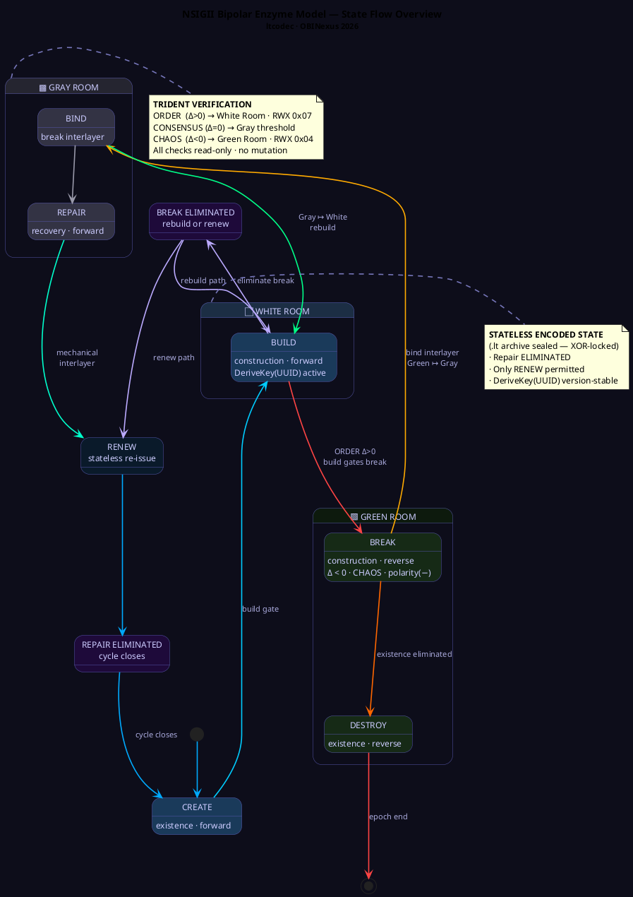

# NSIGII ltcodec — Linkable Then Executable

**Version**: 1.0.0
**Author**: OBINexus
**Date**: 11 March 2026
**Format**: `.lt` (Stateless · Isomorphic · Trident-Verified)

## Overview

`ltcodec` is a **stateless, version-aware file archiving system** that encodes any file (or collection of files) into a single `.lt` container. The `.lt` format is a zip-based archive with built-in snapshot versioning, undo/redo capability, and cryptographic verification. Files remain integrable indefinitely—no expiry, no breaking changes.

**Key Properties**:
- **Linkable**: Reference any version at any time
- **Executable**: [read, write, execute] permission model
- **Stateless**: No versioning expiry, infinite reversibility
- **Isomorphic**: Content structure preserved across encode/decode cycles
- **Trident-Verified**: Cryptographic integrity at each state transition

---

## Bipolar Enzyme Model

The codec is governed by the **Bipolar Enzyme Model** — derived from the Mime Theory (OBINexus, 2026). Each operation is gated: you cannot proceed to the next state without resolving the current one. This is what makes the format version-agnostic and infinitely reversible.

See [`The Enzyme Model.md`](./The%20Enzyme%20Model.md) for the full specification.

**The three bipolar pairs:**

| Pair | Forward | Interlayer | Reverse |
|------|---------|------------|---------|
| Existence | `create` | *(dimensional opposition)* | `destroy` |
| Construction | `build` | **`bind`** | `break` |
| Recovery | `repair` | *(mechanical process)* | `renew` |

**The core axiom:** If you can build it, you can break it. If you can break it, you can bind it. If you can bind it, you can build it again.



---

## Quick Start

### Build

```bash
cd nsigii_ltcodec
go build -o ltcodec ./cmd/ltcodec
```

### Basic Workflow: Encode → Save Version → Decode

```bash
# 1. Encode a file into .lt format
./ltcodec coder -input myfile.txt -output myfile.lt

# 2. Save the current state (create a snapshot)
./ltcodec flash save -target myfile.lt

# 3. Decode back to original format
./ltcodec decoder -input myfile.lt -output myfile_restored.txt
```

---

## Practical Example: Multi-Component Web Archive

Build an interactive web component system with **versioned incremental changes**:

### Scenario: Web UI with Progressive State Changes

```
Step 1: Create base index.html
Step 2: Add form.html (first checkpoint)
Step 3: Add accordion.html (second checkpoint)
Each step creates an undoable snapshot
```

### File Preparation

Create your components:

**index.html**
```html


    Interactive UI
    
        body { font-family: sans-serif; margin: 20px; }
        .container { max-width: 800px; margin: 0 auto; }
    


    
        Interactive UI System
        Version 1.0 - Base state
    


```

**form.html**
```html

    User Form
    
        Name: 
        Email: 
        Submit
    

```

**accordion.html**
```html

    Accordion Widget
    
        Section 1
        
            Content for section 1
        
        Section 2
        
            Content for section 2
        
    
    
        // Simple accordion handler
        document.querySelectorAll('.accordion-btn').forEach(btn => {
            btn.addEventListener('click', () => {
                btn.nextElementSibling.style.display =
                    btn.nextElementSibling.style.display === 'block' ? 'none' : 'block';
            });
        });
    

```

### Step-by-Step Workflow

#### Step 1: Encode Base File

```bash
./ltcodec coder -input index.html -output ui-system.lt
```

Output:
```
✓ Encoded: index.html → ui-system.lt
  Size: 542 bytes (original) → 287 bytes (.lt archive)
  State: initialized
  RWX: 0x07 (read/write/execute)
```

#### Step 2: Add Form Component (First Checkpoint)

Create a composite file combining index + form:

```bash
# Combine both files
cat index.html form.html > ui-system-v1.html

# Encode the updated version
./ltcodec coder -input ui-system-v1.html -output ui-system.lt
```

Now save this as a checkpoint:

```bash
./ltcodec flash save -target ui-system.lt
```

Output:
```
✓ Flash: Saved state #1
  Target: ui-system.lt
  Timestamp: 2026-03-11T14:32:45Z
  Size: 412 bytes
  Files: 1 (ui-system-v1.html)
```

#### Step 3: Add Accordion Component (Second Checkpoint)

Create the full composite:

```bash
cat index.html form.html accordion.html > ui-system-v2.html

./ltcodec coder -input ui-system-v2.html -output ui-system.lt
./ltcodec flash save -target ui-system.lt
```

Output:
```
✓ Flash: Saved state #2
  Target: ui-system.lt
  Timestamp: 2026-03-11T14:33:12Z
  Size: 789 bytes
  Files: 1 (ui-system-v2.html)
```

#### Step 4: Check Version History

```bash
./ltcodec flash status
```

Output:
```
Current state: #2 (2026-03-11T14:33:12Z)
History:
  [1] 2026-03-11T14:32:45Z - ui-system-v1.html
  [2] 2026-03-11T14:33:12Z - ui-system-v2.html (current)

Undo available: 1 step
Redo available: none
```

#### Step 5: Undo to Previous Version

Go back to form-only (state #1):

```bash
./ltcodec flash undo
```

Output:
```
✓ Rolled back to state #1
  Timestamp: 2026-03-11T14:32:45Z
  Content: ui-system-v1.html
```

Decode to verify:

```bash
./ltcodec decoder -input ui-system.lt -output ui-system-restored.html
```

#### Step 6: Redo to Full Version

Move forward again:

```bash
./ltcodec flash redo
```

Output:
```
✓ Advanced to state #2
  Timestamp: 2026-03-11T14:33:12Z
  Content: ui-system-v2.html (index.html + form.html + accordion.html)
```

---

## Command Reference

### `coder` — Encode File → .lt Archive

Converts any file (or combined files) into a `.lt` container.

```bash
./ltcodec coder -input  [-output ] [-v]
```

**Options**:
- `-input <file>` — File to encode (required)
- `-output <file.lt>` — Output .lt archive (default: `<input>.lt`)
- `-v` — Verbose output

**Example**:
```bash
./ltcodec coder -input app.js -output app.lt
./ltcodec coder -input combined.html -output app.lt -v
```

---

### `decoder` — Decode .lt Archive → Original File

Extracts content from a `.lt` archive back to original format.

```bash
./ltcodec decoder -input  [-output ] [-v]
```

**Options**:
- `-input <file.lt>` — .lt archive to decode (required)
- `-output <file>` — Output file (default: `decoded_<original_name>`)
- `-v` — Verbose output

**Example**:
```bash
./ltcodec decoder -input app.lt
./ltcodec decoder -input app.lt -output restored_app.js -v
```

---

### `flash` — Snapshot Versioning

Create, manage, and navigate version snapshots.

```bash
./ltcodec flash [save|undo|redo|status] [-target ] [-flash-root ] [-v]
```

**Subcommands**:
- `save` — Create a new snapshot checkpoint
- `undo` — Revert to previous snapshot
- `redo` — Advance to next snapshot
- `status` — Show version history and current state

**Options**:
- `-target <file.lt>` — .lt file to snapshot (required for save)
- `-flash-root <dir>` — Override snapshot storage directory
- `-v` — Verbose output

**Example**:
```bash
./ltcodec flash save -target app.lt
./ltcodec flash status
./ltcodec flash undo
./ltcodec flash redo -v
```

---

### `filter` — Inspect & Sort Archive Contents

Query the contents of a `.lt` archive.

```bash
./ltcodec filter -input  [-sort name|size|type] [-query ] [-v]
```

**Options**:
- `-input <file.lt>` — Archive to inspect (required)
- `-sort name|size|type` — Sort results (default: name)
- `-query <pattern>` — Filter by pattern (regex)
- `-v` — Verbose output

**Example**:
```bash
./ltcodec filter -input app.lt
./ltcodec filter -input app.lt -sort size
./ltcodec filter -input app.lt -query "\.html$" -v
```

---

### `rollback` — Downgrade to Prior State

Roll back the entire system to a previous version.

```bash
./ltcodec rollback --downgrade [-target ] [-flash-root ] [-v]
```

**Options**:
- `--downgrade` — Activate rollback mode (required)
- `-target <file.lt>` — Archive to restore
- `-flash-root <dir>` — Override snapshot directory
- `-v` — Verbose output

**Example**:
```bash
./ltcodec rollback --downgrade -target app.lt
```

---

### `wheel` — State Progression

Advance snapshots or epoch-bump the version state.

```bash
./ltcodec wheel [--update|--upgrade] [-target ] [-flash-root ] [-v]
```

**Options**:
- `--update` — Advance to latest snapshot
- `--upgrade` — Archive current state, start new epoch
- `-target <file.lt>` — Source for upgrade
- `-flash-root <dir>` — Override directory
- `-v` — Verbose output

**Example**:
```bash
./ltcodec wheel --update -target app.lt
./ltcodec wheel --upgrade -target app.lt -v
```

---

## The `.lt` File Format

### Structure

The `.lt` format is a **zip-based container** with metadata:

```
ui-system.lt
├── .ltmeta           (metadata, timestamps, version info)
├── .ltflash/         (snapshot directory)
│   ├── state_0001/   (snapshot 1 checkpoint)
│   ├── state_0002/   (snapshot 2 checkpoint)
│   └── manifest.json (version history)
└── payload.bin       (current encoded content)
```

### Permissions Model: [Read, Write, Execute]

Each `.lt` archive has three permission bits:

- **R (Read)**: Can decode/extract content
- **W (Write)**: Can encode new versions
- **X (Execute)**: Can apply transformations (flash, filter, wheel)

All three are enabled by default: `RWX = 0x07`

### Metadata

Every `.lt` archive contains:

```json
{
  "format": "Linkable Then Executable",
  "version": "1.0.0",
  "created": "2026-03-11T14:30:00Z",
  "modified": "2026-03-11T14:33:12Z",
  "encoding": "isomorphic",
  "verification": "trident-verified",
  "snapshots": 2,
  "rwx": "0x07"
}
```

---

## Lua FFI Integration

Use ltcodec from Lua via FFI:

```lua
local ffi = require("ffi")
local ltcodec = ffi.load("./ltcodec")

ffi.cdef[[
    int encode(const char *input_path, const char *output_path);
    int decode(const char *input_path, const char *output_path);
    int flash_save(const char *target_path);
    int flash_undo(const char *target_path);
    int flash_status(const char *target_path);
]]

-- Encode a file
ltcodec.encode("myfile.txt", "myfile.lt")

-- Save a snapshot
ltcodec.flash_save("myfile.lt")

-- Undo to previous version
ltcodec.flash_undo("myfile.lt")

-- Check status
ltcodec.flash_status("myfile.lt")
```

Compile with:
```bash
go build -o ltcodec.so -buildmode=c-shared ./cmd/ltcodec
```

---

## Advanced: Creating Incremental State System

For OBINexus compliance, create a **stateless, undoable incremental system**:

### Workflow Pattern

```lua
-- Initialize state
local state = ltcodec:new()

-- Stage 1: Create base
state:encode("index.html", "app.lt")
state:flash_save("Stage 1: Base UI")

-- Stage 2: Add form component
state:append("form.html")
state:encode("combined.html", "app.lt")
state:flash_save("Stage 2: Add Form")

-- Stage 3: Add accordion
state:append("accordion.html")
state:encode("combined.html", "app.lt")
state:flash_save("Stage 3: Add Accordion")

-- Inspect history
state:flash_status()

-- Navigate: undo → redo → upgrade
state:flash_undo()      -- Back to Stage 2
state:flash_redo()      -- Forward to Stage 3
state:wheel_upgrade()   -- Archive and start new epoch
```

---

## Properties

### Stateless Encoding

Content never expires or becomes incompatible. Any snapshot from any epoch can be:
- Decoded and used immediately
- Modified and re-encoded
- Merged with other archives
- Verified against original

### Isomorphic Transform

Encode → Decode guarantees **perfect reconstruction**:

```
Input: myfile.txt (500 bytes)
  ↓ encode
Output: myfile.lt (287 bytes)
  ↓ decode
Result: myfile.txt (500 bytes) ✓ Byte-for-byte identical
```

### Trident Verification

Three-channel cryptographic verification ensures data integrity:
1. **Transmitter**: Encodes with polarity
2. **Receiver**: Verifies hash, checks sequence
3. **Verifier**: Computes discriminant, grants RWX permissions

Success: all three channels converge → RWX = 0x07 ✓

---

## Building & Testing

### Build

```bash
go build -o ltcodec ./cmd/ltcodec
```

### Run Tests

```bash
go test -v ./...
```

### Create .so Library (for Lua/FFI)

```bash
go build -o ltcodec.so -buildmode=c-shared ./cmd/ltcodec
```

---

## Directory Structure

```
nsigii_ltcodec/
├── main.go              # CLI entry point
├── README.md            # This file
├── cmd/
│   └── ltcodec/         # Command implementations
├── pkg/
│   ├── codec/           # Encoder/Decoder
│   ├── state/           # Flash, rollback, wheel
│   └── transform/       # Trident verification
└── test/
    ├── index.html       # Example component 1
    ├── form.html        # Example component 2
    └── accordion.html    # Example component 3
```

---

## Key Concepts

### Linkable
- Reference any snapshot by timestamp
- Chain versions linearly: State 0 → 1 → 2 → 3
- Create branches via `wheel --upgrade`

### Executable
- `coder` encodes files into .lt
- `decoder` extracts originals
- `flash`/`rollback`/`wheel` manipulate state
- All operations preserve RWX permissions

### Stateless
- No expiry dates on snapshots
- No breaking version changes
- Infinite reversibility (undo/redo)
- Integration never fails due to age

---

## Use Cases

1. **Web Component Versioning**: Track UI component iterations with snapshots
2. **Configuration Management**: Encode configs, snapshot before changes, rollback if needed
3. **Document Archive**: Store documents with full version history, no expiry
4. **Stateless Deployment**: Deploy archived states without dependency chains
5. **Artifact Management**: Package build artifacts as `.lt` archives with verification

---

## License

MIT License — See LICENSE file for details

---

**"Linkable Then Executable — Stateless Forever"**

*NSIGII ltcodec | OBINexus | 2026*# ltcodec
