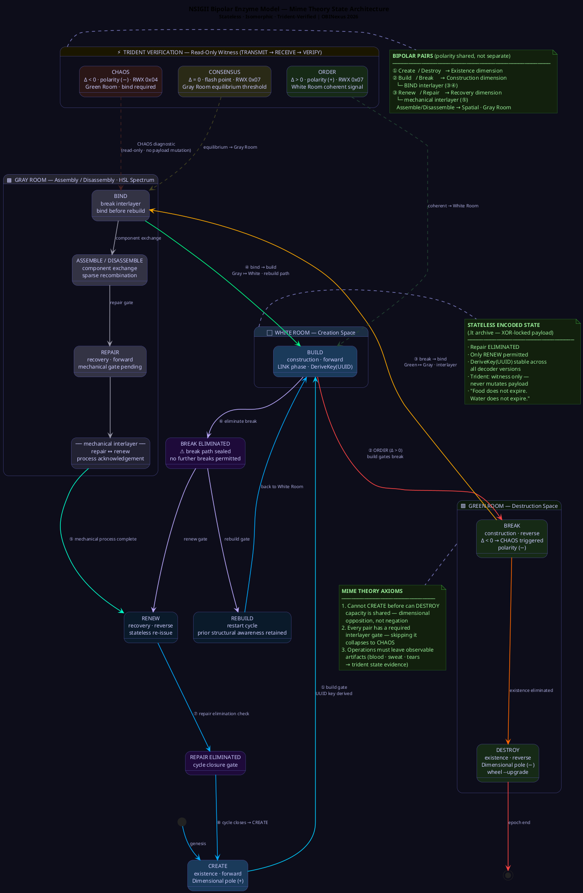

# NSIGII Bipolar Enzyme Model — Mime Theory State Architecture

The Bipolar Enzyme Model defines how the ltcodec system governs state transitions across its operation pairs. Like a biological enzyme that catalyses or gates a reaction, each operation in the model can only proceed if the preceding state was properly resolved. Skipping a gate is not a shortcut — it collapses the system to CHAOS.

---

## State Diagram

> Render with any PlantUML-compatible viewer (VS Code PlantUML extension, plantuml.com/plantuml, or IntelliJ). The diagram is zoomable — all state transitions, rooms, and trident mappings are labelled for screenshot reference.



---

The theoretical basis of this model is the **Mime Theory** — a framework of soft creativity and self-referential creation, introduced by Nnamdi Okpala (OBINexus). It is designated safety-critical Tier 3C, constitutionally bound under UN Article 51.

---

## Mime Theory — Foundational Basis

The Mime Theory is a theorem of *soft creation*: the relationship between creation and destruction as a model for how anything comes into being. The mime — unlike a communicating agent — does not instruct or copy. He *marks*. He performs in a space that is transparent to others, acting on objects that are real but not always visible to external observers.

The glass jug is the canonical example: it is held, it is real, a drink is poured from it — but its translucence means you cannot verify its presence from all angles. It exists in a state that is *known but not always seen*. This is the foundational property of a stateless encoded payload.

The Mime Theory establishes three foundational axioms:

**Axiom 1 — Dimensional Opposition of Existence:**
Create and Destroy are not opposites in the sense of negation — they are *dimensionally opposite*. They share a dimension. A system that can create must be capable of destroy, because you cannot fully create something without the inherent capacity to destroy it. The mime cannot create before he can destroy, because without that capacity the creation is not real — it is only a mark.

**Axiom 2 — Interlayer Transitivity:**
Every adjacent operation pair has an interlayer. The interlayer is not optional — it is the mechanical process that makes the transition valid. Skipping the interlayer produces an invalid state, not a shortcut.

**Axiom 3 — Reflective Verification:**
A system verifies its own reality through visible signs that others can observe: blood, sweat, tears — effort, resistance, and emotional investment. In software terms: state transitions must produce observable artifacts. An operation that leaves no verifiable trace did not occur. This is what the trident verifier enforces.

---

## Operation Pairs and Interlayers

The system is built on four complementary operation pairs. Three of those pairs have explicit interlayers.

| Domain | Forward | Interlayer | Reverse |
|--------|---------|------------|---------|
| **Existence** | create | *(dimensional opposition)* | destroy |
| **Construction** | build | **bind** | break |
| **Recovery** | repair | *(mechanical process)* | renew |
| **Spatial** | assemble | *(gray room threshold)* | disassemble |

These are not symmetric. The *reverse* operation does not restore the prior state — it opens a new, gated path forward.

### The BIND Interlayer

The most critical interlayer is **bind**, which sits between break and build:

> *If you can break something, you can bind it. If you can bind it, you can build it. If you can break it, you can bind it — you can build it.*

Bind is what makes rebuild possible. Without bind, a break is only destruction. With bind, a break becomes the precondition for a new construction cycle. This is the interlayer between the destruction of the old form and the construction of the new one — the point where disassembly ends and assembly can begin.

The mechanical interlayer between **repair** and **renew** functions similarly: it is the process-layer acknowledgement that repair has been attempted before renew is issued. Renew without this acknowledgement is not recovery — it is erasure.

---

## The Three Rooms

The Mime Theory introduces a spatial model for state transitions: three rooms that define where creation, transition, and destruction occur.

### White Room — Creation Space

The White Room is the realm of pure creation. New things emerge here. In the White Room, all colors of a spectrum are possible but not yet fixed — the palette is open. This maps to the initial state of a payload before encoding: fully readable, fully observable, with no constraints on transformation.

The White Room allows a new thing to be formed. It is also where rebuild originates — returning from a prior break cycle restores access to the White Room.

### Gray Room — Assembly and Disassembly Space

The Gray Room is the transitional space between creation and destruction. It is the spectrum: not white, not green, but a gradient of hues that shifts based on how directly you observe it.

The key property of the Gray Room is that it is *shared* — it exists between the White Room and the Green Room and connects them. When you are in the Gray Room you can see the colors of both adjacent realms, but only as hues, as HSL gradients, as spectral shadows. You are observing a reality without being fully inside it.

> *You know they are there, but without them being there you would know they are not there.*

In the Gray Room, the operations are **assemble** and **disassemble**: taking component parts apart and reconstructing new forms from them. The camera example from the Mime Theory is precise — you take a vintage camera apart, recover all components, and assemble a new instrument that performs the same job from different parts. The film, the tape, the lens — each a component that can be substituted or reassigned.

This is the spatial equivalent of the bind interlayer: you cannot assemble without first having disassembled, and disassembly is valid only if the components are bound for reassembly.

The Gray Room is also governed by the **wavelength principle**: higher frequency (more construction pressure) pushes toward the White Room; lower frequency (more destruction pressure) redshifts toward the Green Room. The mastermind model requires you to be able to occupy the Gray Room deliberately — to control where on the spectrum you sit.

### Green Room — Destruction Space

The Green Room is the realm of destruction. Things that enter the Green Room are disassembled back to raw components or dissolved entirely. The Green Room and the White Room are related — they share the energy that the king (the controlling agent) routes through the Gray Room — but they are not the same space.

The Green Room is where **destroy** and **break** are resolved. It is not a terminal state. A system that correctly enters the Green Room and performs destruction cleanly returns to the Gray Room, where bind can begin.

---

## Full State Transition Tree

```
                         ┌──────────────┐
                         │  WHITE ROOM  │
                         │   CREATE     │◄─────────────────────────────────┐
                         └──────┬───────┘                                  │
                                │                                          │
                                ▼                                          │
                         ┌──────────────┐                                  │
                         │    BUILD     │                                  │
                         └──────┬───────┘                                  │
                                │                                          │
              ┌─────────────────┴────────────────┐                         │
              │                                  │                         │
              ▼                                  ▼                         │
     ┌─────────────────┐               ┌──────────────────┐                │
     │  BREAK          │               │  [break elim]    │                │
     │  (Green Room)   │               └────────┬─────────┘                │
     └────────┬────────┘                        │                          │
              │                      ┌──────────┴──────────┐               │
              ▼                      │                     │               │
     ┌────────────────┐              ▼                     ▼               │
     │   BIND         │        ┌──────────┐         ┌──────────┐           │
     │  (Gray Room)   │        │ REBUILD  │         │  RENEW   │           │
     └────────┬───────┘        └────┬─────┘         └────┬─────┘           │
              │                     │                    │                 │
              ▼                     └────────────────────┘                 │
     ┌────────────────┐                      │                             │
     │  BUILD / REPAIR│                      │                             │
     │  (Gray Room)   │◄─────────────────────┘                             │
     └────────┬───────┘                                                    │
              │                                                            │
              ▼                                                            │
     ┌────────────────┐                                                    │
     │   ─mechanical─ │  ← interlayer between repair and renew            │
     └────────┬───────┘                                                    │
              │                                                            │
              ▼                                                            │
     ┌────────────────┐                                                    │
     │  [repair elim] │────────────────────────────────────────────────────┘
     └────────────────┘
```

---

## The Enzyme Rules

### Rule 1 — Build gates Break

If you **build**, you gain the right to **break**. A break that was never built is not a state transition — it is corruption. The system will refuse or enter CHAOS.

### Rule 2 — Break requires Bind before Build resumes

Once a **break** has occurred, **bind** is the required interlayer before any new build can begin. This is what distinguishes a destructive break from a constructive one. The bind operation in the Gray Room takes the broken components and prepares them for reassembly. Without bind, rebuild is not available — the system must renew instead.

### Rule 3 — Break Elimination closes the break path

Once **break** is eliminated (the break path is sealed), the system **cannot re-enter a break state**. The only exits from a sealed state are:

- **Rebuild** — reenter the build→break→bind cycle from scratch
- **Renew** — bypass repair entirely and re-issue a clean state

Rebuild retains structural awareness of the prior cycle. Renew treats the prior cycle as complete and starts fresh.

### Rule 4 — Stateless Encoded State eliminates Repair

When the system is in a **stateless encoded state** (a `.lt` archive has been issued and the payload is XOR-locked), **repair is not available**. Only **renew** is permitted.

This is why `enzymeRepair` in the trident layer is a read-only diagnostic in the decoder, not a recovery path. A stateless payload cannot be repaired in-place — it must be renewed by re-encoding from source. The Gray Room is inaccessible from a sealed White Room artifact.

### Rule 5 — Repair Elimination gates Create

**Repair** can itself be eliminated. When it is, the only continuation is back to **create**. This closes the loop: the tree returns to its root and a new cycle may begin. The mechanical interlayer between repair and renew must be acknowledged before elimination is valid — a renew that skips acknowledgement of attempted repair is an erasure, not a recovery.

### Rule 6 — Create and Destroy are Dimensionally Opposite

You cannot create before you can destroy, because they occupy the same dimension at opposite poles. This is not a temporal rule — it is a capacity rule. A system that has no destroy capacity also has no true create capacity, because creation without the possibility of destruction is not creation — it is a mark, a mime gesture, visible only from certain angles. The glass jug: it pours, it exists, but its translucence means you must know what to look for.

---

## The Color Spectrum and State Space

The Gray Room operates on a wavelength principle derived from the color spectrum. Just as ROYGBIV is one ordering of visible frequencies — not the only possible ordering — the system's state space is a continuum, not a fixed set of discrete steps.

Higher bit-density in the payload (more set bits, more energy, higher frequency) pushes the discriminant toward ORDER (Δ > 0) — the White Room. Lower bit-density pushes toward CHAOS (Δ < 0) — the Green Room. CONSENSUS (Δ = 0) is the flash point: the exact midpoint of the spectrum, the gray between white and green.

HSL governs the Gray Room's observation model: when you are not directly in a room you are still observing it, but as hues, as desaturated gradients. You know the colors are there; you can see them shift. But you do not have full spectrum access until you cross the threshold and enter the room.

---

## In-Chat vs. In-Document Contexts

| Context | Active Enzyme Rule |
|---|---|
| **Chat (interactive session)** | Full enzyme model applies. All operations including bind, assemble, and disassemble are available subject to gate rules. State transitions are tracked per-session. |
| **Document (encoded/stateless)** | Repair is eliminated. Only **renew** is permitted. The document represents a sealed White Room artifact — mutations must go through a new create cycle. |

The enzyme model in chat behaves like an open Gray Room: states can proceed forward, be gated, or be rerouted through bind. In a document context, the payload is fixed — no in-place correction is allowed without breaking the isomorphic contract.

---

## Mapping to ltcodec Trident States

The Enzyme Model is grounded directly in the Trident verification layer:

| Trident State | Discriminant (Δ) | Room | Enzyme Mapping |
|---|---|---|---|
| **ORDER** | Δ > 0 | White Room | Build is active. Forward construction is coherent. Full RWX. |
| **CONSENSUS** | Δ = 0 | Gray Room threshold | Flash point. Equilibrium between build and break. Full RWX. Bind is active. |
| **CHAOS** | Δ < 0 | Green Room | Break has occurred. Enzyme repair diagnostic triggered (read-only). System must bind, then rebuild — or renew. |

When the decoder reports `state: CHAOS | polarity: -`, the payload is in the Green Room — the break gate has fired without a prior build, or the interlayer was skipped. The system is gated. Resolution requires bind → rebuild, or a full renew from the White Room.

---

## Summary

```
WHITE ROOM  →  build  →  BREAK (Green Room)  →  BIND (Gray Room)  →  build
                │                                                        │
           [break elim]                                            repair / renew
                │                                                        │
            rebuild / renew  ─────────────────────────────────────► CREATE

GRAY ROOM:  assemble ↔ disassemble  (wavelength threshold, HSL spectrum)
GREEN ROOM: destroy / break  (dimensional opposite of create/build)
WHITE ROOM: create / build   (pure construction, all spectrum open)

stateless state:  repair eliminated  →  renew only  (no Gray Room access)
mime axiom:       cannot create before can destroy  →  capacity is shared
```

The Enzyme Model ensures that every destructive operation is gated by a prior constructive one, every recovery is scoped to what the current state actually permits, and every interlayer is traversed rather than skipped. It is the enforcement layer behind ltcodec's *Stateless · Isomorphic · Trident-Verified* guarantee — and the software embodiment of the Mime Theory's axiom that creation and destruction are not opposites but dimensional companions.
